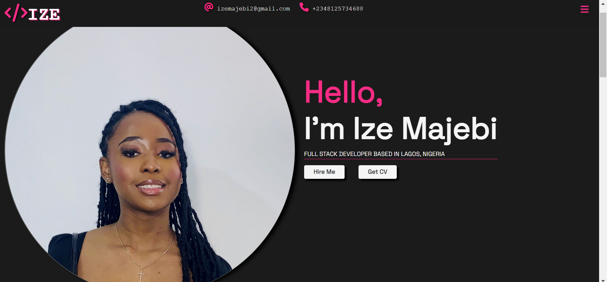
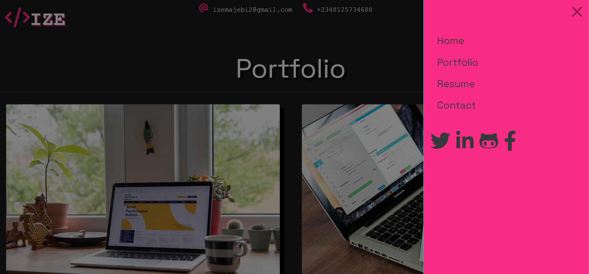
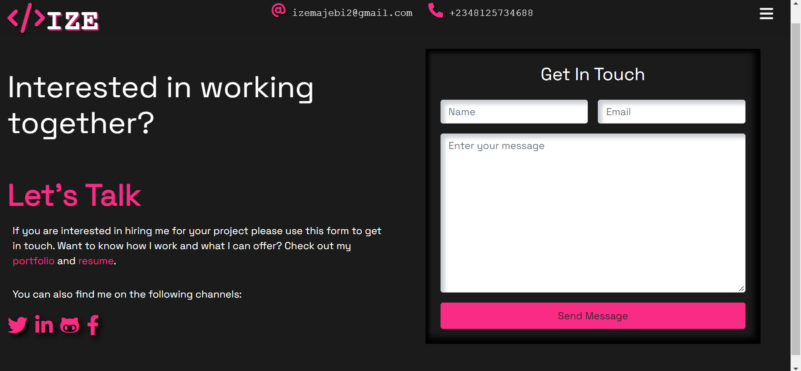

<h2>Demo Portfolio prioject.</h2> 
This project was one of the first full websites I worked on when starting my software development journey. It is a responsive full-stack developer portfolio demo.
Just thought to share this as it was my first passion project, and it could give inspiration to others for their portfolios.

Coding Languages: 
HTML, CSS,and Bootstrap

